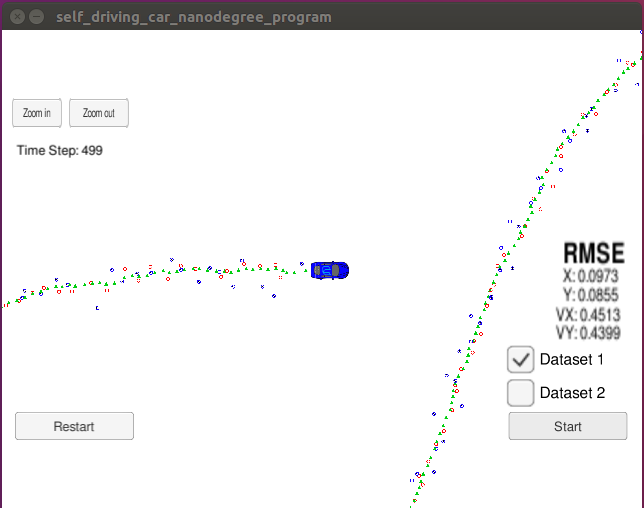

# Extended Kalman Filter

## Overview

The goals/steps of this project are the following:
* Track an object’s position and velocity by implementing an Extended Kalman Filter in C++
* Ensure that the projects compiles on any platform
* Test the Kalman filter in the Term 2 Simulator provided by Udacity
* Evaluate the performance of our algorithm
* Summarize the results with a written report

## Compiling

My program can be built and run by doing the following:
1. `mkdir build` (from the project's top directory)
2. `cd build`
3. `cmake ..`
4. `make`
5. `./ExtendedKF`

## Accuracy

I tested my Kalman Filter algorithm in the simulator with Dataset 1. I evaluated its performance, using the accuracy metric of RMSE (Root Mean Squared Error).

RMSE measures the deviation of the estimated state from the true state. The lower are the RMSE values for our `px`, `py`, `vx`, `vy` output coordinates, the higher is our estimation accuracy. The RMSE calculation is being handled in the `tools.cpp` file by the `CalculateRMSE` function, which the `main.cpp` is calling. In the picture below you can see my RMSE results.

## Algorithm

##### My Sensor Fusion algorithm follows the general processing flow as taught in the Udacity lessons.

For implementing the algorithm, I followed the steps as described in the course, and I used the starter code as provided by Udacity. All the programming files that we need are located in the src folder of the project. In the `src` folder, you can find the:

- `Eigen` library which helps us do all the matrix math involved in this project,
- `FusionEKF.cpp` and its header file `FusionEKF.h`, which handle the high-level of the filter,
- `json.hpp` which is for the simulator `uWebSocketIO` interface,
- `kalman_filter.cpp`, in which we implement all the equations of our Kalman Filter, and its corresponding header file `kalman_filter.h`,
- the main program file of our project `main.cpp`, which does all the interfacing between our algorithm and the simulator,
- `measurement_package.h` which helps passing all the measurement data to the filter,
- and finally `tools.cpp` (and its header file `tools.h`) where we implement the calculations of the jacobian matrix `Hj` and our metric of accuracy RMSE.

##### My Kalman Filter algorithm handles the first measurements appropriately.

At first, I initialized variables and matrices in the `FusionEKF` class constructor (lines 17-58 of `FusionEKF.cpp`). Specifically, I set the `H_laser_` measurement matrix for LiDAR, I initialized the transition matrix `F_` and the covariance matrix `P_`, as well as the acceleration noise components, all as described in the lessons.
	
Then moving on to the `ProcessMeasurement` function (lines 65-121 of `FusionEKF.cpp`), we initialize the state vector `ekf.x_` and overwrite its first two components based on whether the measurement is coming from the radar or the laser. As far as the radar is concerned, I have to convert from polar to cartesian coordinates before. Lastly, I set the state the transition matrix `F_` and the state covariance matrix `P_` as given in classroom. 

##### My Kalman Filter algorithm first predicts then updates.

For the prediction step, first I compute the dt between current and previous measurements, and I adjust the `F_` matrix, so that the time is integrated. The process covariance matrix `Q_` is calculated as well, taking into consideration the `noise_ax` and `noise_ay` (lines 136-152 of `FusionEKF.cpp`).

Then the `Predict()` function is called, for I which I had to complete its definition by adding the corresponding equations for the prediction step of the kalman filter (lines 24-33 of `kalman_filter.cpp`). Then according to the type of sensor data, the algorithm proceeds to the update step.

##### My Kalman Filter can handle radar and lidar measurements.

The update step of the algorithm is calculated differently, based on the type of sensor data. If the measurement comes from a LiDAR, then the update step will use the Kalman Filter equations (see lines 35-53 of `kalman_filter.cpp`). If the measurement comes from a radar though, then the Jacobian matrix should be calculated instead, so as to linearize the equations. See lines 167-184 of `FusionEKF.cpp` for the calling of `UpdateEKF()` and `Update()`. The `UpdateEKF()` uses the extended kalman filter equations (lines 55-88 of the `kalman_filter.cpp`).

In the `UpdateEKF()` function, I included normalization of the radar measurements, so that the angle `phi` in the `y` vector is adjusted between `-pi` and `pi` (lines 71-75 of the `kalman_filter.cpp`).

For the calculation of the Jacobian matrix the `CalculateJacobian()` function is used, which is defined in the `tools.cp` file (lines 52-83).
